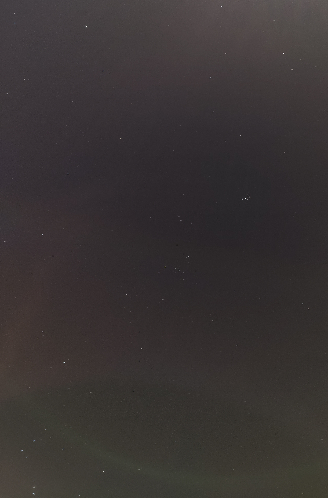
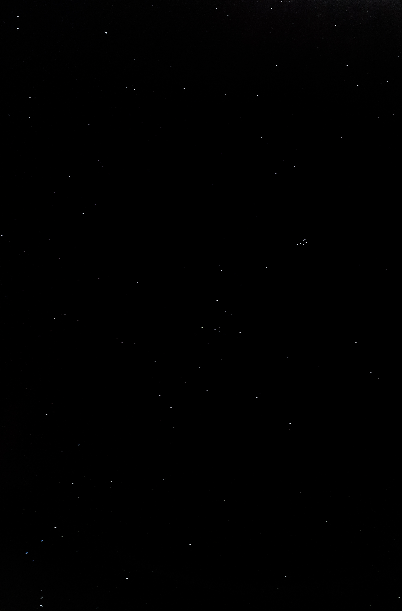

*🚧 Page under construction 🚧*

An Archive of all my Lightroom presets, ill be adding on to it as time goes by.

# Instructions on how to get the preset
1. Download the image below, it should be in .DNG format (if it isnt hit me up)
2. Then follow instructions on this site for importing and saving the preset - [link to the site](https://helpx.adobe.com/lightroom-cc/using/import-presets-mobile.html)

# Presets
## [Sky with only Stars](https://1drv.ms/u/s!AkspV7zbetPnvApHDeJCAcZYxNNv?e=MAtQgc)
### Before and After
{: width="300" .normal}       {: width="300" .normal}
